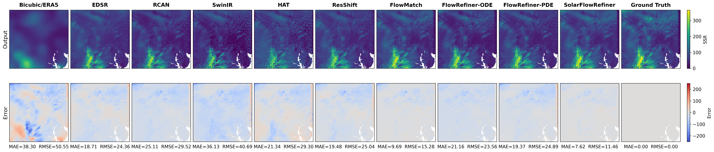

<p align="center">
<h1 align="center"><strong>☀️ SolarFlowRefiner: Refinement-Aware Flow Matching <br> for Surface Solar Radiation Downscaling</strong></h1>
  <p align="center">
    <a>Udbhav Srivastava<sup>1</sup>,</a>
    <a>Antonita Racheal<sup>1</sup>,</a>
    <a>Yiheng Chen<sup>1</sup>,</a>
    <a>Runlong Yu<sup>1</sup>,</a>
    <a>Xinyue Ye<sup>2</sup></a>
    <br>
    <sup>1</sup>Department of Computer Science, University of Alabama<br>
    <sup>2</sup>Department of Geography, University of Alabama
  </p>

<p align="center">
  <a href="https://arxiv.org/abs/2609.22126" target="_blank">
    
  </a>
  <a href="https://github.com/UdbhavSrivastava/SolarFlowRefiner" target="_blank">
    
  </a>
  <a href="https://github.com/UdbhavSrivastava/SolarFlowRefiner/blob/main/LICENSE" target="_blank">
    
  </a>
</p>

<p align="center">
  
</p>

## Overview

High-resolution surface solar radiation (SSR) downscaling from coarse ERA5 reanalysis to fine SolarCube targets is hard because cloud-driven irradiance variability is sharp, localized, and inherently ambiguous. Post-hoc refinement approaches optimize the generator independently from the correction process, creating a stage-wise mismatch:

1. **One-to-many ambiguity** — a single coarse ERA5 cell may contain both sunlit and cloud-shadowed regions, making the high-resolution SSR field inherently uncertain.
2. **Oversmoothing** — deterministic models trained with pixel-wise losses regress toward conditional means, missing sharp cloud-boundary gradients.
3. **Stage-wise mismatch** — post-hoc refinement trains the generator independently, even though its output determines the refiner's initial state.

**SolarFlowRefiner** addresses all three with a unified design:

* A **prediction-conditioned refinement path** constructed from the current FlowMatch output rather than the ground-truth target, exposing the refiner to the structured errors produced by the generator.
* A **PDE-style multilevel denoising refiner** that progressively corrects residual errors over $K{=}8$ levels with an exponentially decaying noise schedule.
* A **refinement-aware joint optimization** where the refinement loss is backpropagated through the differentiable FlowMatch sampler, allowing the generator and refiner to co-adapt.

Empirically, SolarFlowRefiner achieves **18% lower MAE** and **16% lower RMSE** than the strongest post-hoc PDE refiner on the ERA5–SolarCube benchmark, while improving structural fidelity (SSIM: 0.727 → 0.827).

## Key Results

Test-set SSR downscaling performance (32,159 train / 4,519 val / 8,994 test samples). Lower is better for MAE, RMSE, LPIPS, FID; higher is better for SSIM.

| Method | MAE ↓ | RMSE ↓ | SSIM ↑ | LPIPS ↓ | FID ↓ |
|--------|--------|---------|---------|----------|--------|
| Bicubic | 137.22 | 169.61 | 0.339 | 0.664 | 290.15 |
| EDSR | 29.53 | 42.71 | 0.675 | 0.187 | 46.03 |
| RCAN | 14.81 | 24.11 | 0.724 | 0.177 | 44.92 |
| SwinIR | 16.71 | 26.91 | 0.712 | 0.183 | 39.21 |
| HAT | 15.25 | 24.07 | 0.726 | 0.171 | 37.73 |
| ResShift | 13.94 | 20.68 | 0.725 | 0.159 | 36.47 |
| FlowMatch | 14.88 | 23.30 | 0.742 | 0.154 | **35.42** |
| FlowRefiner-ODE | 14.60 | 22.85 | 0.743 | 0.156 | 36.43 |
| FlowRefiner-PDE | 13.58 | 20.31 | 0.727 | 0.161 | 37.49 |
| **SolarFlowRefiner** | **11.13** | **17.11** | **0.827** | **0.137** | 36.23 |

<p align="center">
  
</p>

> **Figure 2**: SSR reconstruction and error maps for a held-out test sample. SolarFlowRefiner produces the lowest per-sample MAE and RMSE, reducing both broad residual bias and localized cloud-edge errors.

### Input-Channel Ablation

The ERA5 SSR baseline is used for residual reconstruction in all settings; ablation changes only the conditioning channels provided to the learned generator and refiner.

| Conditioning | MAE ↓ | RMSE ↓ | SSIM ↑ | LPIPS ↓ | FID ↓ |
|--------------|--------|---------|---------|----------|--------|
| ERA5 only | 21.82 | 36.21 | 0.651 | 0.172 | 41.90 |
| SolarCube only | 17.31 | 24.70 | 0.710 | 0.155 | 37.10 |
| **ERA5 + SolarCube** | **11.13** | **17.11** | **0.827** | **0.137** | **36.23** |

## Installation

```bash
git clone https://github.com/UdbhavSrivastava/SolarFlowRefiner.git
cd SolarFlowRefiner
conda create -n solarflow python=3.9 -y
conda activate solarflow
conda install pytorch torchvision torchaudio pytorch-cuda=11.8 -c pytorch -c nvidia -y
pip install -r requirements.txt
```

Tested with **PyTorch 2.0+** and a single NVIDIA GPU. Peak VRAM for the main setting (end-to-end SolarFlowRefiner, batch size 1, $K{=}8$ refinement levels) is ≈17 GB; an RTX 5060 or better is recommended.

## Data

SolarFlowRefiner trains on two complementary sources:

| Dataset | Resolution | Channels | Role |
|---------|-----------|----------|------|
| **ERA5** | ~0.25° (~25 km) | 5 radiative | Coarse physical baseline |
| **SolarCube** | High-res (~1 km) | 5 auxiliary + SSR target | Cloud context + ground truth |

**ERA5 radiative channels (5):**
`era_ssrd`, `era_ssr`, `era_ssrdc`, `era_fdir`, `era_cdir`

**SolarCube auxiliary channels (5):**
`vis047`, `vis086`, `ir133`, `sza`, `cm`

**Target:**
`solarcube_ssr_hourly` — Hourly mean high-resolution SSR field

**Dataset split.** Day-blocked train/validation/test with 70/10/20 ratio:

| Split | Samples | Fraction |
|-------|---------|----------|
| Train | 32,159 | 70% |
| Validation | 4,519 | 10% |
| Test | 8,994 | 20% |

**Tiles used:** 1-10, 12, 14 (12 global stations passing quality-control threshold)
**Split strategy:** Whole UTC-day blocks within each tile/month to prevent temporal leakage

**Download & preprocessing.**

**Dataset:** The preprocessed ERA5 and SolarCube data is available at:
[Google Drive - SolarFlowRefiner Dataset](https://drive.google.com/drive/folders/1_Y1awqj32KqWV9nyHO2co4hj1Zj0FN9r?usp=sharing)

1. Download raw ERA5 and SolarCube files from the link above and place in `data/raw/`
2. Check inputs:
   ```bash
   python preprocess.py check
   ```
3. Preprocess raw files:
   ```bash
   python preprocess.py preprocess --tiles 1-10,12,14 --months 1-12
   ```
4. Create day-block splits:
   ```bash
   python preprocess.py splits --split-tiles 1-10,12,14 --split-months 1-12 --seed 42
   ```

This generates `splits/train_index.csv`, `splits/val_index.csv`, and `splits/test_index.csv`.

## Quick Start

### Training modes

SolarFlowRefiner supports **two** training strategies. Both land on the same final configuration: **end-to-end refinement-aware generation with K=8 refinement levels**.

| Mode | What it does | Schedule | Paper result |
|------|--------------|----------|--------------|
| `joint` | Train SolarFlowRefiner end-to-end from scratch | 100 epochs single stage | **recommended**: reaches MAE = 11.13, RMSE = 17.11 |
| `two_stage` | (1) pretrain FlowMatch base (100 ep), (2) train PDE refiner on frozen base (100 ep) | 100 ep + 100 ep | Post-hoc baseline: MAE = 13.58, RMSE = 20.31 |

Why joint is preferred: End-to-end optimization allows the generator to learn residuals that are both accurate and refinable, rather than optimizing each stage independently. The two-stage mode reproduces the FlowRefiner-PDE post-hoc baseline.

**Recommended: End-to-end joint training**

```bash
python train.py --model solarflowrefiner \
  -- --train-index splits/train_index.csv \
     --val-index splits/val_index.csv \
     --out-dir runs/SolarFlowRefiner \
     --epochs 100
```

**Training details:**
- Batch size: 1
- Learning rates: 2×10⁻⁶ (FlowMatch generator), 2×10⁻⁵ (refiner)
- Optimizer: AdamW with weight decay 10⁻⁴
- EMA decay: 0.9999
- Refinement levels: $K{=}8$
- Noise schedule: $\sigma \in [0.35, 0.01]$ (exponential decay)
- Hardware: Nvidia RTX 5060 (~17 GB VRAM)

### Two-stage workflow (post-hoc baseline)

**Stage 1 — FlowMatch pretrain (100 epochs)**

```bash
python train.py --model flowmatch \
  -- --train-index splits/train_index.csv \
     --val-index splits/val_index.csv \
     --out-dir runs/FlowMatch \
     --epochs 100 \
     --batch-size 4 \
     --lr 2e-5
```

**Stage 2a — FlowRefiner-ODE (frozen generator)**

```bash
# Precompute base predictions
python run_experiment.py --model flowrefiner-ode --stage precompute \
  -- --index splits/train_index.csv \
     --run-dir runs/FlowMatch \
     --out runs/base_cache/train_base.npy

python run_experiment.py --model flowrefiner-ode --stage precompute \
  -- --index splits/val_index.csv \
     --run-dir runs/FlowMatch \
     --out runs/base_cache/val_base.npy

# Train ODE refiner
python train.py --model flowrefiner-ode \
  -- --train-index splits/train_index.csv \
     --val-index splits/val_index.csv \
     --train-base-cache runs/base_cache/train_base.npy \
     --val-base-cache runs/base_cache/val_base.npy \
     --base-run-dir runs/FlowMatch \
     --out-dir runs/FlowRefiner-ODE \
     --epochs 100
```

**Stage 2b — FlowRefiner-PDE (frozen generator)**

```bash
# Precompute base predictions (if not already done for ODE)
python run_experiment.py --model flowrefiner-pde --stage precompute \
  -- --index splits/train_index.csv \
     --run-dir runs/FlowMatch \
     --out runs/base_cache/train_base.npy

python run_experiment.py --model flowrefiner-pde --stage precompute \
  -- --index splits/val_index.csv \
     --run-dir runs/FlowMatch \
     --out runs/base_cache/val_base.npy

# Train PDE refiner
python train.py --model flowrefiner-pde \
  -- --train-index splits/train_index.csv \
     --val-index splits/val_index.csv \
     --train-base-cache runs/base_cache/train_base.npy \
     --val-base-cache runs/base_cache/val_base.npy \
     --base-run-dir runs/FlowMatch \
     --out-dir runs/FlowRefiner-PDE \
     --epochs 100
```

### Evaluation

```bash
python evaluate.py --model solarflowrefiner \
  -- --test-index splits/test_index.csv \
     --run-dir runs/SolarFlowRefiner
```

Metrics computed: MAE, RMSE, SSIM, LPIPS, FID

## Method Summary

**Setup.** Given coarse ERA5 radiative variables and high-resolution SolarCube auxiliary channels $x$, predict the high-resolution SSR field $y$ via normalized residual generation relative to the upsampled ERA5 SSR baseline $b$.

**Residual formulation.**

$$
r = y - b, \quad \tilde{r} = \frac{r - \mu_r}{\sigma_r}, \quad \hat{y} = b + \sigma_r \hat{\tilde{r}} + \mu_r
$$

**Architecture.** A multiscale residual U-Net (base channel 64, multipliers $(1,2,4,8)$, 2 residual blocks per stage) serves as both FlowMatch generator and PDE refiner.

**FlowMatch predictor.** Learn a rectified flow between Gaussian noise $z_0 \sim \mathcal{N}(0,I)$ and the normalized target residual $z_1 = \tilde{r}$:

$$
z_t = (1-t)z_0 + t z_1, \quad \mathcal{L}_{\mathrm{FM}} = \mathbb{E}_{t,z_0,\tilde{r}} \left[ \| f_\theta(z_t,x,t) - (z_1 - z_0) \|_1 \right]
$$

At inference, integrate the learned ODE $\frac{dz}{dt} = f_\theta(z,x,t)$ from $t{=}0$ to $t{=}1$ using an 8-step Euler solver to produce the base residual $\tilde{r}_b$.

**Prediction-conditioned refinement path.** Construct refinement states from the current generator prediction:

$$
c_k = (1-\alpha_k)\tilde{r}_b + \alpha_k \tilde{r}, \quad \bar{c}_k = c_k + \sigma_k \epsilon, \quad \epsilon \sim \mathcal{N}(0,I)
$$

where $\alpha_k = k/(K{-}1)$ and $\sigma_k$ decays exponentially from 0.35 to 0.01 over $K{=}8$ levels. This exposes the refiner to the **structured errors** produced by the current generator.

**PDE-style refiner.** The refiner $g_\phi$ predicts the clean target residual from noisy intermediate states:

$$
\hat{r}_k = g_\phi(\bar{c}_k, x, \tilde{r}_b, k)
$$

$$
\mathcal{L}_{\mathrm{ref}} = \| \hat{r}_k - \tilde{r} \|_1 + \lambda_{\mathrm{mse}} \| \hat{r}_k - \tilde{r} \|_2^2 + \lambda_{\nabla} \| \nabla \hat{r}_k - \nabla \tilde{r} \|_1
$$

At inference, refinement proceeds iteratively:

$$
u_0 = \tilde{r}_b, \quad u_{k+1} = u_k + \eta (\hat{r}_k - u_k)
$$

**Refinement-aware joint optimization.** SolarFlowRefiner runs the differentiable FlowMatch sampler inside the training loop:

$$
\mathcal{L}_{\mathrm{joint}} = \lambda_{\mathrm{FM}} \mathcal{L}_{\mathrm{FM}} + \lambda_{\mathrm{ref}} \mathcal{L}_{\mathrm{ref}}
$$

Because $\tilde{r}_b = S_\theta(z_0,x)$ appears in both the refinement path and refiner conditioning, gradients flow back through the sampler. This allows the generator and refiner to co-adapt.

**Model variants.**

| Model | Generator | Refiner | Coupling |
|-------|-----------|---------|----------|
| FlowMatch | FlowMatch | None | N/A |
| FlowRefiner-ODE | FlowMatch (frozen) | ODE correction | Post-hoc |
| FlowRefiner-PDE | FlowMatch (frozen) | PDE denoising | Post-hoc |
| **SolarFlowRefiner** | FlowMatch (trainable) | PDE denoising | **End-to-end** |

## Repository Layout

```
SolarFlowRefiner/
├── Model/
│   ├── FlowMatch/              # Standalone flow matching generator
│   │   ├── train.py
│   │   ├── evaluate.py
│   │   └── model.py
│   ├── FlowRefiner-ODE/        # Post-hoc ODE-style refiner
│   ├── FlowRefiner-PDE/        # Post-hoc PDE-style refiner
│   ├── SolarFlowRefiner/       # End-to-end refinement-aware model
│   └── unet.py                 # Shared U-Net backbone
├── Dataset/
│   └── preprocessing/          # Data pipeline scripts
│       ├── build_dataset.py
│       ├── dataset_builder.py
│       ├── check_inputs.py
│       ├── create_splits.py
│       └── run_pipeline.py
├── utils/
│   ├── core.py                 # Data loading, statistics, path handling
│   └── metrics.py              # SSIM evaluation
├── configs/                    # Model configuration files (JSON)
├── scripts/                    # Example training/evaluation commands
├── train.py                    # Top-level training router
├── evaluate.py                 # Top-level evaluation router
├── run_experiment.py           # Model/stage dispatcher
├── preprocess.py               # Data preprocessing entry point
├── requirements.txt            # Python dependencies
└── README.md
```

## Reproducing Paper Numbers

To reproduce the best SolarFlowRefiner result (MAE = 11.13, RMSE = 17.11):

```bash
# End-to-end joint training (~100 epochs on RTX 5060, batch_size=1)
python train.py --model solarflowrefiner \
  -- --train-index splits/train_index.csv \
     --val-index splits/val_index.csv \
     --out-dir runs/SolarFlowRefiner \
     --epochs 100

# Evaluate on held-out test set
python evaluate.py --model solarflowrefiner \
  -- --test-index splits/test_index.csv \
     --run-dir runs/SolarFlowRefiner
```

## Citation

If you find this work useful, please cite:

```bibtex
% Citation will be added upon publication
```
